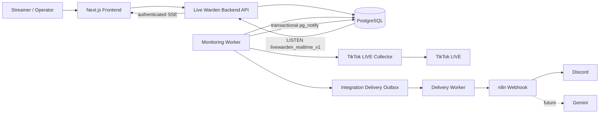

# Live Warden Technical Architecture

## Scope and Principles

This design derives from `../Overview.md`, PRD-01 through PRD-09, and [`Domain-Contract.md`](./Domain-Contract.md). Live Warden is one application with a request path and a background processing path. Separate Docker processes provide operational isolation without premature microservices.

Core ownership remains inside Live Warden: stream status, Live Session lifecycle, event detection, alert generation, severity, deduplication, and persistence. n8n orchestrates external workflows only. Gemini provides interpretation only; it never decides technical status or alert severity.

## System Context

## Components

| Component | Responsibility | Owns business logic? |
| --- | --- | --- |
| Next.js Frontend | Authenticated UI, initial REST reads, SSE-driven invalidation, 120-second fallback polling, forms, accessible state presentation | No |
| Backend API | Authentication, authorization, CRUD, read models, domain commands, PostgreSQL listener, authorized SSE fan-out | Yes |
| Monitoring Worker | Scheduling and executing checks; invokes domain processing | Yes, through shared application/domain modules |
| TikTok LIVE Collector | Provider adapter; returns normalized observation or typed failure | No; provider-specific boundary only |
| PostgreSQL | Durable source of truth and queryable history | No |
| n8n | Workflow orchestration and Discord notification delivery | No |
| Discord | External notification channel | No |
| Gemini | Session summary and insight generation | No |

Monitoring Worker and Backend API use the same application code and database contract. Worker is a separate Docker process/container, not an independent microservice. PostgreSQL remains the persistence source of truth. Realtime `NOTIFY` is a transient post-commit signal, not a message queue or storage; no database schema/table migration is required for it.

Delivery Worker is a separate process in the same project. Core transactions create outbox intents only; Delivery Worker performs bounded authenticated HTTP calls to n8n. Local Docker n8n routes verified alert deliveries to Discord. Delivery failure changes only `integration_deliveries`.

## Data Flows

1. User authenticates through Frontend and Backend API; API reads/writes user-scoped data in PostgreSQL.
2. Worker selects enabled streams, invokes Collector, validates the observation, persists snapshot/state, then evaluates session, events, and alerts.
3. Inside the worker/domain transaction, normalized v1 realtime events are published with transactional `SELECT pg_notify` on `livewarden_realtime_v1`; PostgreSQL delivers them only after commit.
4. API holds a dedicated `pg.Client` with `LISTEN`, reconnects with exponential delays from 1 to 30 seconds, validates notifications, resolves stream ownership, and broadcasts only to the owning authenticated user and optional stream subscription.
5. Frontend loads authoritative state through REST. SSE events are invalidation hints, debounced 150 ms before REST refetch; detail uses one stream-scoped connection, dashboard one user-scoped connection. A 120-second fallback poll remains active.
6. Browser `EventSource` reconnects natively. `stream.resync` and reconnect trigger REST resync because notification delivery and `Last-Event-ID` replay are not durable.
7. Core domain creates integration delivery records and sends non-blocking requests to n8n.
8. n8n routes selected alert delivery payloads to Discord. Gemini remains a later integration and is not implemented.

## Service Boundaries

- API boundary: authenticated HTTP request/response; never trusts client ownership fields.
- Realtime boundary: same-origin cookie-authenticated SSE; stream ownership failures return 404. API filters every PostgreSQL notification by owning user and optional stream.
- Worker boundary: internal background execution; claims work safely and is restartable.
- Collector boundary: provider-specific input/output; no database writes or status decisions inside adapter.
- Automation boundary: versioned outbound payload and delivery status; external workflow cannot mutate core state directly.
- AI boundary: sanitized closed-session data in, structured summary out.

## Failure Isolation

Collector timeout, provider error, n8n outage, Discord failure, and Gemini failure are recorded independently. Core monitoring commits state, snapshots, sessions, events, and alerts without waiting for notification or AI completion. Delivery retries are bounded. A failed delivery cannot close, reopen, or change a Live Session or stream technical status.

## Deployment

Development and MVP deployment use Docker containers for Frontend, Backend API, Monitoring Worker, PostgreSQL, and n8n. Discord and Gemini remain external services. Exact deployment environment, orchestration, and scaling are Open Decisions. One PostgreSQL instance is the persistence boundary for MVP.

`LISTEN` is session-bound. Realtime API deployments require a direct PostgreSQL connection or session pooling; transaction-pooled connections are unsupported for the dedicated listener.

## Closed Decisions

- Backend foundation: Fastify with TypeScript, kept as one application boundary.
- ORM/query layer: Drizzle ORM with PostgreSQL driver.
- Domain statuses: text columns plus database `CHECK` constraints, not PostgreSQL native enums.
- User deletion FK behavior: `NO ACTION`/restrictive; user deletion is not available until an explicit history-preserving policy exists.

## Open Decisions

- TikTok credential requirement and production-safe rate-limit strategy.
- LIKE multi-session validation and gift semantics.
- Worker concurrency limit and non-realtime collector timeout/retry values.
- Deployment environment.
- Gemini model and token budget.
