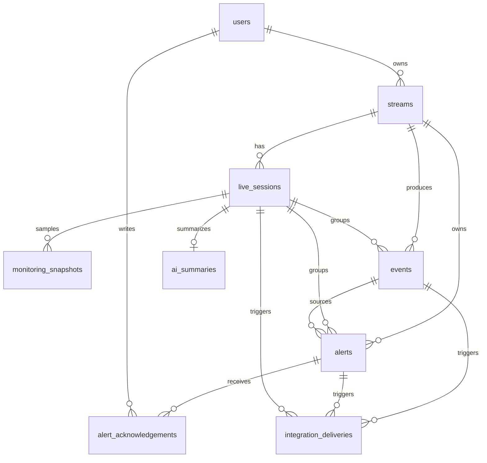

# Live Warden Database Design

## Authority and Scope

`Domain-Contract.md` is canonical for enums, semantics, lifecycle, timestamps, metrics, and event payloads. This document translates that contract into a PostgreSQL migration design. Implementation uses Drizzle ORM, `drizzle-kit`, and the `pg` driver. Domain statuses use text columns plus PostgreSQL `CHECK` constraints, never native PostgreSQL enums.

All user-facing reads and writes scope through `users.id` or owned `streams.user_id`. Stream deletion is soft delete. Historical sessions, events, alerts, acknowledgements, and AI summaries remain.

## Final Entity Set

## Type Conventions

- IDs: `UUID` generated by application/database.
- Timestamps: `TIMESTAMPTZ`, always UTC.
- Counters/durations: non-negative `BIGINT` or `INTEGER` as appropriate.
- Provider IDs and usernames: `TEXT`; provider room ID remains opaque.
- Structured bounded context: `JSONB`.
- Secret values are not stored in these tables.
- Enums may be PostgreSQL enums or text plus `CHECK`; migration should choose one consistently.

## `users`

**Purpose:** email/password account and ownership root.

| Column | Type | Null | Default/constraint |
| --- | --- | --- | --- |
| `id` | UUID | no | primary key |
| `email` | TEXT | no | normalized lowercase; unique |
| `password_hash` | TEXT | no | never plaintext |
| `created_at` | TIMESTAMPTZ | no | current UTC |
| `updated_at` | TIMESTAMPTZ | no | current UTC |

Index: unique normalized `email`.

## `streams`

**Purpose:** user-owned TikTok channel configuration and current monitoring projection.

| Column | Type | Null | Default/constraint |
| --- | --- | --- | --- |
| `id` | UUID | no | primary key |
| `user_id` | UUID | no | FK `users.id`; restrict/cascade policy must preserve history |
| `name` | TEXT | no | non-empty check |
| `platform` | TEXT/enum | no | `TIKTOK_LIVE` |
| `external_identifier` | TEXT | no | canonical username without leading `@`; non-empty |
| `monitoring_enabled` | BOOLEAN | no | false |
| `status` | TEXT/enum | no | `UNKNOWN`; Domain Contract Stream Status |
| `last_checked_at` | TIMESTAMPTZ | yes | latest attempted check |
| `last_successful_at` | TIMESTAMPTZ | yes | latest successful valid collection |
| `last_observed_provider_at` | TIMESTAMPTZ | yes | provider observation/event time |
| `last_room_id` | TEXT | yes | opaque provider Room ID |
| `last_observation_metadata` | JSONB | yes | bounded metadata only; no full raw payload by default |
| `deleted_at` | TIMESTAMPTZ | yes | null means active |
| `created_at` | TIMESTAMPTZ | no | current UTC |
| `updated_at` | TIMESTAMPTZ | no | current UTC |

Constraints/indexes:

- FK `user_id`.
- `platform = 'TIKTOK_LIVE'` for MVP.
- `status` restricted to `LIVE`, `OFFLINE`, `DEGRADED`, `UNKNOWN`, `DISCONNECTED`.
- Unique active stream `(user_id, platform, external_identifier)` partial where `deleted_at IS NULL`.
- Index `(user_id, monitoring_enabled, deleted_at)` for worker selection.
- Index `(user_id, status, deleted_at)` for dashboard counts.
- Index `(user_id, created_at DESC)` for list ordering.

Lifecycle: create, enable/disable monitoring, update status projection, soft delete. Deleted streams are excluded from active list/worker but remain for historical FK references.

## `live_sessions`

**Purpose:** one verified livestream episode per Stream.

| Column | Type | Null | Default/constraint |
| --- | --- | --- | --- |
| `id` | UUID | no | primary key |
| `stream_id` | UUID | no | FK `streams.id` |
| `provider_room_id` | TEXT | yes | opaque TikTok Room ID |
| `started_at` | TIMESTAMPTZ | no | verified LIVE acceptance time |
| `ended_at` | TIMESTAMPTZ | yes | verified OFFLINE acceptance time |
| `state` | TEXT/enum | no | `ACTIVE` or `COMPLETED` |
| `final_status` | TEXT/enum | yes | set on completion; normally `OFFLINE` |
| `duration_seconds` | BIGINT | yes | non-negative; set on completion |
| `peak_viewers` | BIGINT | yes | max valid `monitoring_snapshots.current_viewers` |
| `average_viewers` | NUMERIC | yes | arithmetic average of valid snapshots; not time-weighted |
| `total_comments` | BIGINT | yes | sampled accepted comment events; null if not calculated |
| `total_like_activity` | BIGINT | yes | sum accepted `LIKE.count`; limitation applies |
| `total_gifts` | BIGINT | yes | null until gift semantics validated |
| `event_count` | BIGINT | yes | derived report aggregate |
| `alert_count` | BIGINT | yes | derived report aggregate |
| `created_at` | TIMESTAMPTZ | no | current UTC |
| `updated_at` | TIMESTAMPTZ | no | current UTC |

Constraints/indexes:

- `state = ACTIVE` iff `ended_at IS NULL`; `COMPLETED` iff `ended_at IS NOT NULL`.
- `final_status` nullable only while active; completed requires `final_status = OFFLINE` unless later product rule permits another terminal status.
- Counters/duration non-negative.
- Partial unique index `(stream_id) WHERE state = 'ACTIVE'` guarantees one active session.
- Index `(stream_id, started_at DESC)` for history.
- Index `(provider_room_id)` only if operational lookup requires it; not a uniqueness constraint.

Lifecycle: create only from verified LIVE; update during live/degraded/unknown/disconnected; complete only from verified OFFLINE. Reconnect with same Room ID updates same active row.

## `monitoring_snapshots`

**Purpose:** one attempted collector check and normalized observation; raw history source retained 30 days.

| Column | Type | Null | Default/constraint |
| --- | --- | --- | --- |
| `id` | UUID | no | primary key |
| `stream_id` | UUID | no | FK `streams.id` |
| `live_session_id` | UUID | yes | FK `live_sessions.id`; nullable outside session |
| `checked_at` | TIMESTAMPTZ | no | local UTC acceptance/check time |
| `provider_occurred_at` | TIMESTAMPTZ | yes | provider time, e.g. `common.createTime` |
| `collection_succeeded` | BOOLEAN | no | true/false |
| `status_observed` | TEXT/enum | no | canonical status result when available |
| `room_id` | TEXT | yes | opaque provider ID |
| `current_viewers` | BIGINT | yes | `ROOM_USER.total`; non-negative |
| `collector_latency_ms` | INTEGER | yes | non-negative |
| `error_code` | TEXT/enum | yes | canonical collector error; required when failed |
| `error_message` | TEXT | yes | sanitized diagnostic; no secrets |
| `provider_metadata` | JSONB | yes | bounded normalized metadata only |
| `attempt_key` | TEXT | no | idempotency key |
| `created_at` | TIMESTAMPTZ | no | current UTC |

Constraints/indexes:

- Successful row requires `error_code IS NULL`; failed row requires `error_code IS NOT NULL`.
- `current_viewers`, latency non-negative.
- Unique `(stream_id, attempt_key)`.
- Index `(stream_id, checked_at DESC)`.
- Index `(live_session_id, checked_at DESC)`.
- Index `(checked_at)` for retention.
- Index `(collection_succeeded, checked_at DESC)` for operational queries.

Retention: delete rows older than 30 days. Historical aggregates/events remain.

## Audience Metrics Decision: Option A

Use **Option A**. Keep viewer snapshots and collection-level audience values in `monitoring_snapshots`; store high-volume audience activity as Events. Do not create `audience_metrics` table for MVP.

Reason:

- Spike 2 proved current viewers are event-driven `ROOM_USER.total` observations naturally attached to a check.
- Comments and likes are event semantics, not a separate time-series row requirement.
- Gifts are not semantically validated; premature metric table would encode unsafe aggregation.
- Avoids duplicate `snapshot_id`/`live_session_id` time-series storage.
- Session arithmetic average and peak can calculate from valid snapshot rows.

If later volume or query performance requires a specialized metric store, add it after measurement and migration design review. `audience_metrics` is therefore not in the final MVP entity set.

## `events`

**Purpose:** immutable timeline facts and activity events.

| Column | Type | Null | Default/constraint |
| --- | --- | --- | --- |
| `id` | UUID | no | primary key; envelope `eventId` |
| `schema_version` | INTEGER | no | 1; positive |
| `event_type` | TEXT/enum | no | canonical event names |
| `stream_id` | UUID | no | FK `streams.id` |
| `live_session_id` | UUID | yes | FK `live_sessions.id` |
| `source` | TEXT | no | `tiktok` for provider events, `live_warden` for derived events |
| `occurred_at` | TIMESTAMPTZ | no | event occurrence UTC |
| `received_at` | TIMESTAMPTZ | no | local receipt UTC |
| `payload` | JSONB | no | bounded values; no unnecessary PII |
| `metadata` | JSONB | no | bounded diagnostics/context |
| `created_at` | TIMESTAMPTZ | no | current UTC |

Event types: `STREAM_STARTED`, `STREAM_ENDED`, `VIEWER_SPIKE`, `VIEWER_DROP`, `COMMENT_ACTIVITY_SPIKE`, `GIFT_ACTIVITY_SPIKE`, `MONITORING_FAILED`, `MONITORING_RECOVERED`, `CONNECTION_LOST`, `CONNECTION_RECOVERED`.

Constraints/indexes:

- Immutable application policy; no update/delete in normal operations.
- `schema_version > 0`.
- Index `(stream_id, occurred_at DESC)`.
- Index `(live_session_id, occurred_at DESC)`.
- Index `(event_type, occurred_at DESC)`.
- Index `(occurred_at)` for retention/report queries.

Events additionally use non-null `idempotency_key` with unique `(stream_id, idempotency_key)` for immutable logical-event deduplication.

## `alerts`

**Purpose:** actionable condition derived by Live Warden rule engine.

| Column | Type | Null | Default/constraint |
| --- | --- | --- | --- |
| `id` | UUID | no | primary key |
| `stream_id` | UUID | no | FK `streams.id` |
| `live_session_id` | UUID | yes | FK `live_sessions.id` |
| `source_event_id` | UUID | yes | FK `events.id` |
| `alert_type` | TEXT | no | rule identity |
| `severity` | TEXT/enum | no | `INFO`, `WARNING`, `CRITICAL` |
| `status` | TEXT/enum | no | `ACTIVE`, `ACKNOWLEDGED`, `RESOLVED` |
| `deduplication_key` | TEXT | no | stable condition identity |
| `first_detected_at` | TIMESTAMPTZ | no | first match |
| `last_detected_at` | TIMESTAMPTZ | no | latest match |
| `acknowledged_at` | TIMESTAMPTZ | yes | latest/first acknowledgement projection |
| `resolved_at` | TIMESTAMPTZ | yes | recovery time |
| `description` | TEXT | no | actionable context |
| `trigger_value` | JSONB | yes | bounded evidence |
| `recommended_action` | TEXT | yes | user guidance |
| `created_at` | TIMESTAMPTZ | no | current UTC |
| `updated_at` | TIMESTAMPTZ | no | current UTC |

Constraints/indexes:

- `last_detected_at >= first_detected_at`.
- `resolved_at` required only for `RESOLVED`; unresolved alerts have null `resolved_at`.
- Partial unique index `(deduplication_key) WHERE status IN ('ACTIVE','ACKNOWLEDGED')` prevents unresolved duplicates.
- Index `(stream_id, status, first_detected_at DESC)`.
- Index `(live_session_id, first_detected_at DESC)`.
- Index `(severity, status, first_detected_at DESC)`.
- Index `(last_detected_at DESC)` for recovery evaluation.

Repeated detection updates `last_detected_at` and evidence. `ACKNOWLEDGED` does not return to `ACTIVE`. Resolved records remain historical.

## `alert_acknowledgements`

**Purpose:** historical user acknowledgement audit.

| Column | Type | Null | Default/constraint |
| --- | --- | --- | --- |
| `id` | UUID | no | primary key |
| `alert_id` | UUID | no | FK `alerts.id` |
| `user_id` | UUID | no | FK `users.id` |
| `acknowledged_at` | TIMESTAMPTZ | no | current UTC |
| `note` | TEXT | yes | bounded length |
| `created_at` | TIMESTAMPTZ | no | current UTC |

Index `(alert_id, acknowledged_at DESC)`. Authorization follows `alert -> stream -> user`; record is append-only.

## `ai_summaries`

**Purpose:** current/final AI interpretation for one Live Session.

| Column | Type | Null | Default/constraint |
| --- | --- | --- | --- |
| `id` | UUID | no | primary key |
| `live_session_id` | UUID | no | FK `live_sessions.id`; unique current summary |
| `status` | TEXT/enum | no | `PENDING`, `COMPLETED`, `FAILED` |
| `session_summary` | TEXT | yes | required when completed |
| `key_moments` | JSONB | yes | structured, references verified events |
| `audience_changes` | TEXT | yes | structured result field |
| `problems` | JSONB | yes | structured result field |
| `insights` | JSONB | yes | structured result field |
| `recommendations` | JSONB | yes | structured result field |
| `limitations` | JSONB | yes | unavailable-data caveats |
| `model` | TEXT | yes | model identifier |
| `failure_reason` | TEXT | yes | required when failed; sanitized |
| `requested_at` | TIMESTAMPTZ | no | current UTC |
| `generated_at` | TIMESTAMPTZ | yes | completion time |
| `created_at` | TIMESTAMPTZ | no | current UTC |
| `updated_at` | TIMESTAMPTZ | no | current UTC |

Constraints/indexes:

- Unique `live_session_id` for one current/final MVP summary.
- Completed requires `generated_at` and summary result; failed requires `failure_reason`.
- Index `(status, updated_at DESC)` for processing.

AI summary is not source of truth. Report metrics remain available on AI failure.

## `integration_deliveries`

**Purpose:** delivery observability and retry record for n8n workflows.

| Column | Type | Null | Default/constraint |
| --- | --- | --- | --- |
| `id` | UUID | no | primary key |
| `event_id` | UUID | yes | FK `events.id` |
| `alert_id` | UUID | yes | FK `alerts.id` |
| `live_session_id` | UUID | yes | FK `live_sessions.id` |
| `destination` | TEXT/enum | no | `N8N`, `DISCORD`, `GEMINI` |
| `delivery_type` | TEXT | no | workflow purpose |
| `status` | TEXT/enum | no | delivery status enum |
| `idempotency_key` | TEXT | no | unique per logical delivery |
| `attempt_count` | INTEGER | no | 0 or greater |
| `last_attempt_at` | TIMESTAMPTZ | yes | latest attempt |
| `next_attempt_at` | TIMESTAMPTZ | yes | retry schedule |
| `succeeded_at` | TIMESTAMPTZ | yes | success time |
| `last_error` | TEXT | yes | sanitized diagnostic |
| `created_at` | TIMESTAMPTZ | no | current UTC |
| `updated_at` | TIMESTAMPTZ | no | current UTC |

Constraints/indexes:

- At least one of `event_id`, `alert_id`, `live_session_id` is non-null.
- `attempt_count >= 0`.
- Unique `(destination, idempotency_key)`.
- Index `(status, next_attempt_at)` for retry worker.
- Index `(event_id)`, `(alert_id)`, `(live_session_id)` for audit.

Delivery records cannot mutate core business state. n8n/Discord/Gemini failures remain delivery failures.

## Cross-Table Integrity

- Historical FKs use `RESTRICT` or soft-delete-safe behavior; do not cascade-delete historical rows when a stream is soft-deleted.
- User authorization must be enforced in application queries and, if feasible, database row-level policy.
- Live Session closure and aggregate calculation occur transactionally with verified OFFLINE domain decision.
- Event/alert creation occurs after valid observation/status transition is accepted.
- External delivery creation occurs after core event/alert/session transaction commits.

## Retention and Lifecycle

- Delete `monitoring_snapshots` older than 30 days, including their bounded provider metadata.
- No `audience_metrics` table in MVP; audience snapshots follow snapshot retention.
- Retain streams with `deleted_at`, live sessions, events, alerts, acknowledgements, AI summaries, and delivery audit records.
- Backup/restore and deletion job execution policy remain deployment decisions.

## Open Decisions

- Exact JSONB payload allowlist and PII minimization policy.
- Backup target, restore procedure, and retention job scheduler.
- Whether report aggregates are materialized or calculated at session close; current design permits materialized session report fields for stable historical reporting.
- Final gift aggregation after runtime semantics validation.
