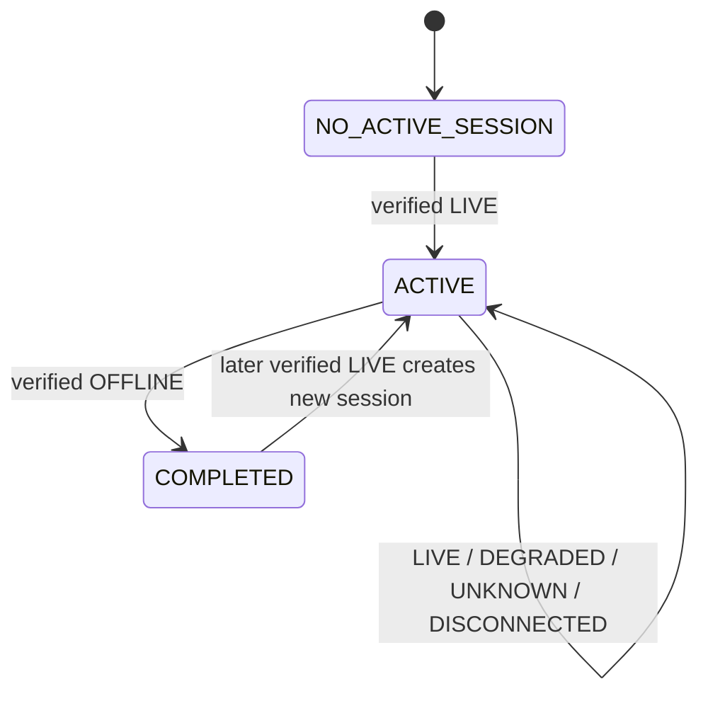
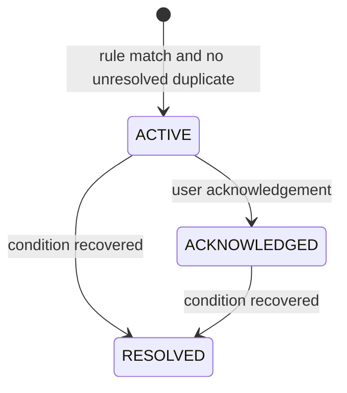

# Live Warden Canonical Domain Contract

## Authority

This document is canonical for domain enums, entity semantics, state transitions, monitoring results, metrics, events, alerts, errors, identifiers, and timestamps. It derives from `../Overview.md`, PRD-01 through PRD-09, and Spike 2 evidence in `TikTok-Collector-Validation.md`. Other technical documents must reference this contract when wording differs.

## Domain Enums

### Stream Status

| Value | Meaning | Session effect |
| --- | --- | --- |
| `LIVE` | Provider check verifies livestream active. | Create or keep one active session. |
| `OFFLINE` | Provider check verifies livestream inactive. | Close active session only. |
| `DEGRADED` | Stream remains verified live, but a technical/monitoring degradation rule matches. | Keep active session. |
| `UNKNOWN` | Individual check failed or is ambiguous; status cannot be determined. | Never create or close a session. |
| `DISCONNECTED` | Collector/provider integration is operationally unusable. | Do not automatically close session. |

Generic TikTok `connect()` failure is never implicitly `OFFLINE`. `DEGRADED` requires valid live evidence; exact rules remain Open Decision.

### Alert Severity

`INFO`, `WARNING`, `CRITICAL`.

### Alert Lifecycle

`ACTIVE`, `ACKNOWLEDGED`, `RESOLVED`.

An acknowledged alert remains `ACKNOWLEDGED` while its condition persists. Recovery changes it to `RESOLVED`; repeated detection does not reactivate it.

### Platform

`TIKTOK_LIVE` for MVP.

### AI Summary Status

`PENDING`, `COMPLETED`, `FAILED`.

### Integration Delivery Status

`PENDING`, `IN_PROGRESS`, `SUCCEEDED`, `FAILED`, `ABANDONED`.

Exact retry policy is Open Decision.

## Entity Semantics

- **User:** email/password account and owner scope.
- **Stream:** persistent user-owned TikTok channel configuration. Soft-deleted; historical records remain.
- **Live Session:** one verified livestream episode belonging to one Stream.
- **Monitoring Snapshot:** one collector check result at one `checkedAt` time; raw payload is not required by default.
- **Audience Metric:** current viewer snapshot and selected activity values tied to a snapshot. MVP stores these in `monitoring_snapshots`; see Database decision.
- **Event:** immutable detected fact or activity record. No lifecycle status.
- **Alert:** actionable condition derived by Live Warden rules from events, metrics, or status.
- **Alert Acknowledgement:** append-only user acknowledgement record.
- **AI Summary:** current/final interpretation for one completed session; never technical truth.
- **Integration Delivery:** operational record for external workflow delivery; never core business truth.

## Stream and Session Lifecycle



Rules:

- Maximum one active session per stream.
- `UNKNOWN` without prior active evidence does not create a session.
- `UNKNOWN`, `DEGRADED`, and `DISCONNECTED` never close an active session.
- Only verified `OFFLINE` closes a session.
- Reconnect with same provider Room ID does not create a new session.
- Unexpected-stop grace period remains Open Decision.
- `startedAt` is first accepted live observation time unless provider start time is explicitly trusted.
- `endedAt` is time verified offline evidence is accepted.

## Monitoring Result Contract

Collector result and domain status are separate:

```json
{
  "provider": "tiktok",
  "requestedIdentifier": "@creator",
  "canonicalIdentifier": "creator",
  "checkedAt": "UTC timestamp",
  "collection": {
    "successful": true,
    "latencyMs": 1234,
    "providerOccurredAt": "UTC timestamp|null"
  },
  "observation": {
    "providerLive": true,
    "roomId": "opaque-provider-id|null",
    "title": null,
    "currentViewers": 123,
    "comments": { "count": 1, "items": [] },
    "likes": { "eventCount": 15, "cumulativeCandidate": 3429960 },
    "gifts": { "items": [], "semantics": "UNVALIDATED" },
    "metadata": {}
  },
  "error": null
}
```

For failure:

```json
{
  "provider": "tiktok",
  "requestedIdentifier": "@creator",
  "canonicalIdentifier": "creator",
  "checkedAt": "UTC timestamp",
  "collection": { "successful": false, "latencyMs": 10000, "providerOccurredAt": null },
  "observation": null,
  "error": {
    "code": "UNKNOWN_COLLECTOR_ERROR",
    "retryable": false,
    "message": "redacted diagnostic"
  }
}
```

Live Warden maps a successful, sufficiently evidenced observation to Stream Status. A failed or ambiguous result normally maps to `UNKNOWN`; persistent integration failure maps to `DISCONNECTED`. Collector does not create sessions, events, alerts, or persistence.

## TikTok Metric Contract

Evidence source: Spike 2 runtime on `@tv_asahi_news`.

| Source | Canonical field | Semantics | MVP use |
| --- | --- | --- | --- |
| `ROOM_USER` | `total` | Current viewer snapshot; event-driven; non-cumulative; variable cadence. | Store as `currentViewers`. |
| `ROOM_USER` | `totalUser` | Separate provider aggregate, not current viewers. | Do not use as viewers. |
| `CHAT` | `content` | Comment text; one callback represented one comment event in samples. | Store minimal event data. |
| `CHAT` | `user` | User identity available. | Minimize/redact; store only required identifier if product needs it. |
| `CHAT.common` | `createTime` | Provider event timestamp when available. | Preserve separately from local receipt. |
| `LIKE` | `count` | Event/delta-like count. | Activity event metric. |
| `LIKE` | `total` | Cumulative-like candidate/advisory; short runtime sample was not strictly monotonic. | Display/context only; not canonical total. |
| `GIFT` | `giftId`, `gift.name`, `repeatCount`, `repeatEnd` | Field availability documented; runtime semantics unvalidated. | Do not final-aggregate yet. |

Arithmetic average viewers is the average of valid `currentViewers` snapshots, not time-weighted. Peak viewers is maximum valid snapshot.

Likes may be incomplete because library/provider may omit events on high-viewer streams. Gift streak semantics and cumulative/delta aggregation remain Open Validation.

## Identifier Semantics

- `streamId`, `liveSessionId`, `eventId`, `alertId`, `userId`, and delivery IDs are Live Warden UUIDs.
- TikTok username is normalized by trimming URL/leading `@` and storing canonical identifier without leading `@`.
- `providerRoomId` is an opaque string; do not parse or use as Live Warden primary key.
- Same provider Room ID across reconnect belongs to same Live Session.
- Provider username and Live Warden Stream ID are distinct identifiers.

## Timestamp Semantics

All persisted timestamps are UTC.

| Field | Meaning |
| --- | --- |
| `checkedAt` | Local UTC time when collector check/result was accepted by Live Warden. |
| `providerOccurredAt` | Provider event/observation time, e.g. `common.createTime`; nullable and untrusted until validated. |
| `createdAt` | UTC time database record was created. |
| `updatedAt` | UTC time mutable record last changed. |
| `startedAt` | UTC time Live Session became active from verified LIVE evidence. |
| `endedAt` | UTC time session closed from verified OFFLINE evidence. |
| `firstDetectedAt` | First UTC time alert condition was detected. |
| `lastDetectedAt` | Latest UTC time same unresolved alert condition was detected. |
| `resolvedAt` | UTC time alert condition recovered. |
| `acknowledgedAt` | UTC time user acknowledgement was recorded. |
| `receivedAt` | UTC time Live Warden received an external event/callback, when needed. |

Frontend converts UTC for user timezone; domain comparisons use UTC.

## Event Contract

Canonical types:

`STREAM_STARTED`, `STREAM_ENDED`, `COMMENT`, `LIKE`, `VIEWER_SPIKE`, `VIEWER_DROP`, `COMMENT_ACTIVITY_SPIKE`, `GIFT_ACTIVITY_SPIKE`, `MONITORING_FAILED`, `MONITORING_RECOVERED`, `CONNECTION_LOST`, `CONNECTION_RECOVERED`.

Canonical envelope:

```json
{
  "eventId": "uuid",
  "schemaVersion": 1,
  "type": "VIEWER_SPIKE",
  "occurredAt": "UTC timestamp",
  "streamId": "uuid",
  "liveSessionId": "uuid|null",
  "source": "tiktok",
  "payload": {},
  "metadata": {}
}
```

Events are immutable and append-only. `payload` contains event values; `metadata` contains bounded diagnostic/context fields. Do not include unnecessary TikTok user content or secrets. Events do not automatically create alerts. Event idempotency uses `idempotency_key` with unique `(stream_id, idempotency_key)`. COMMENT stores aggregate `count` plus required `username`, `displayName`, and `text` fields for Recent Comments and future Session Intelligence. No avatar, bio, follower count, or unrelated user metadata is persisted. Persisted comment content is retention-sensitive and must follow LiveWarden retention policy when PRD-09 retention is implemented. LIKE stores `LIKE.count` delta only. Gifts are not emitted until semantics are validated.

## Realtime Invalidation Contract

Realtime notifications are transport messages, not persisted domain Events. Canonical types are `stream.status`, `stream.viewer_count`, `stream.comment`, `stream.like`, and `stream.alert`. `stream.ready` and `stream.resync` are SSE control events.

```json
{
  "id": "uuid",
  "schemaVersion": 1,
  "type": "stream.status",
  "streamId": "uuid",
  "identifier": "creator",
  "occurredAt": "ISO-8601 timestamp",
  "payload": { "status": "LIVE" }
}
```

`payload` is bounded. Publication occurs inside the authoritative worker/domain transaction using `SELECT pg_notify` on `livewarden_realtime_v1`, therefore notification delivery starts only after commit. PostgreSQL `NOTIFY` is transient, not durable storage or queue. UUID `id` provides stable identity for one notification but does not provide durable `Last-Event-ID` replay. Consumers reconnect with native `EventSource`, handle `stream.resync`, and refetch authoritative REST state.

API ownership lookup binds each notification to stream owner. Delivery is allowed only to that authenticated user and, when present, matching stream subscription. Realtime notifications never create domain Events, change alert lifecycle, or replace database state.

## Alert Contract

Alerts are created only by Live Warden's deterministic rule engine. Each alert has stream association, optional session association, type, severity, lifecycle status, deduplication key, `firstDetectedAt`, `lastDetectedAt`, details, trigger value, and recommended action.



Repeated detection updates `lastDetectedAt` and evidence. It does not create duplicate alerts or return `ACKNOWLEDGED` to `ACTIVE`. Recovery sets `RESOLVED`; record remains historical. n8n cannot create or resolve authoritative alerts.

## Collector Error Taxonomy

Canonical internal error codes:

- `USER_NOT_FOUND`
- `STREAM_OFFLINE`
- `COLLECTOR_TIMEOUT`
- `NETWORK_ERROR`
- `PROVIDER_UNAVAILABLE`
- `AUTHENTICATION_ERROR`
- `RATE_LIMITED`
- `CONNECTION_ERROR`
- `COLLECTOR_ERROR`
- `UNKNOWN_COLLECTOR_ERROR`

Error code is not Stream Status. Example:

```text
UNKNOWN_COLLECTOR_ERROR
    -> failed monitoring result
    -> Stream Status UNKNOWN
```

Suggested mapping only when evidence is sufficient:

| Error | Typical status effect | Evidence requirement |
| --- | --- | --- |
| `STREAM_OFFLINE` | `OFFLINE` | Provider explicitly verifies offline. |
| `USER_NOT_FOUND` | No status change or `UNKNOWN` | Stable provider not-found evidence. |
| `COLLECTOR_TIMEOUT`, `NETWORK_ERROR`, `CONNECTION_ERROR` | `UNKNOWN` | Individual/transient failure. |
| `PROVIDER_UNAVAILABLE`, `AUTHENTICATION_ERROR` | `DISCONNECTED` | Operational persistence or explicit provider evidence. |
| `RATE_LIMITED` | `UNKNOWN` or `DISCONNECTED` | Depends on scope/duration; do not guess. |
| generic collector errors | `UNKNOWN` | No narrower evidence. |

Spike 2 left `USER_NOT_FOUND`, `STREAM_OFFLINE`, timeout, network, provider unavailable, authentication, and rate-limit classification as Open Validation. Generic errors must remain generic.

## Open Validation and Decisions

- Safe TikTok rate-limit budget.
- Timeout/network failure mapping.
- Stable `OFFLINE` versus `USER_NOT_FOUND` evidence.
- LIKE semantics across multiple sessions.
- Gift event and streak semantics.
- Provider terms and access policy.
- Modified AGPL license review.
- Redacted fixture contract tests.
- Version pinning/upgrade policy.
- Exact degradation, alert, viewer, activity, and unexpected-stop rules.
- Deployment environment, worker concurrency, non-realtime retry values, and Gemini model/token budget.
