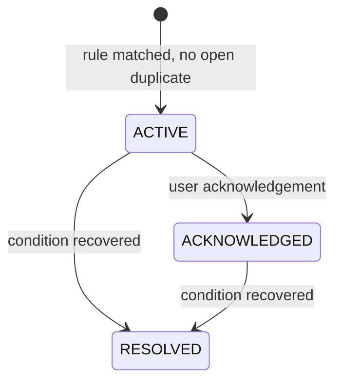

# Live Warden Events and Alerts

Canonical enums and envelope: [`Domain-Contract.md`](./Domain-Contract.md).

## Event versus Alert

An **Event** is an immutable fact or detected change in the monitoring timeline. An **Alert** is an actionable condition created only when an alert rule matches an event, state, or metric. Events do not necessarily create alerts. Alert acknowledgement does not alter technical stream state.

## Event Types

`STREAM_STARTED`, `STREAM_ENDED`, `COMMENT`, `LIKE`, `VIEWER_SPIKE`, `VIEWER_DROP`, `COMMENT_ACTIVITY_SPIKE`, `GIFT_ACTIVITY_SPIKE`, `MONITORING_FAILED`, `MONITORING_RECOVERED`, `CONNECTION_LOST`, `CONNECTION_RECOVERED`.

Event Engine foundation emits `STREAM_STARTED`, `STREAM_ENDED`, `COMMENT`, and `LIKE`. COMMENT and LIKE are aggregated per monitoring attempt and sampled/best-effort; persisted only with an active Live Session. COMMENT stores `count` plus bounded `username`, `displayName`, and `text` fields required by Recent Comments and future Session Intelligence. No additional user metadata is persisted; comment content is retention-sensitive. LIKE stores `LIKE.count` delta only; `LIKE.total` is ignored. Gift events remain unimplemented until provider semantics are validated.

## Event Envelope

Canonical envelope is defined in [`Domain-Contract.md`](./Domain-Contract.md): `eventId`, `schemaVersion`, `type`, `occurredAt`, `streamId`, nullable `liveSessionId`, `source`, `payload`, and `metadata`.

```json
{
  "eventId": "uuid",
  "schemaVersion": 1,
  "type": "VIEWER_DROP",
  "occurredAt": "UTC timestamp",
  "streamId": "uuid",
  "liveSessionId": "uuid|null",
  "source": "tiktok",
  "payload": { "current": 120, "baseline": 300 },
  "metadata": {}
}
```

Events are persisted before external automation is attempted. Payload metadata must not contain secrets. Event IDs and schema versions support deduplication and contract evolution.

## Realtime Notification Contract

Realtime notifications are separate from persisted domain Events. Worker/domain transactions publish normalized schema v1 notifications using transactional `SELECT pg_notify` on PostgreSQL channel `livewarden_realtime_v1`. Delivery occurs only after commit, so API clients are never told to read uncommitted state. `NOTIFY` is transient and is neither durable queue nor storage.

Canonical notification names are `stream.status`, `stream.viewer_count`, `stream.comment`, `stream.like`, and `stream.alert`. Envelope:

```json
{
  "id": "uuid",
  "schemaVersion": 1,
  "type": "stream.viewer_count",
  "streamId": "uuid",
  "identifier": "creator",
  "occurredAt": "ISO-8601 timestamp",
  "payload": { "currentViewers": 120 }
}
```

Payload is bounded and carries only enough context for invalidation. UUID `id` is stable notification identity, but no durable `Last-Event-ID` replay exists. Browser reconnect and `stream.resync` must cause REST refetch. Alert notifications do not alter canonical `ACTIVE`/`ACKNOWLEDGED`/`RESOLVED` lifecycle.

## Event Lifecycle

Events are append-only facts. They have no active/resolved state. A later recovery is a separate event. Every event references a stream; session reference is required when the event occurs during an open session and nullable for stream-level failures outside a session.

## Alert Rules

Rules are deterministic Live Warden domain logic. MVP rule categories:

| Condition | Candidate event/trigger | Default severity |
| --- | --- | --- |
| Stream unexpectedly stops | `STREAM_ENDED` plus stop policy | `CRITICAL` |
| Repeated monitoring failures | `MONITORING_FAILED` count/window | `WARNING` or `CRITICAL` |
| Provider connection unavailable | `CONNECTION_LOST` | `CRITICAL` |
| Significant viewer decline | `VIEWER_DROP` | `WARNING` |
| Data absent beyond stale threshold | monitoring age | `WARNING` |
| Informational lifecycle change | stream/session event | `INFO` |

Exact thresholds and unexpected-stop grace period are Open Decisions. AI never evaluates these rules.

## Severity and Status

Severity is `INFO`, `WARNING`, or `CRITICAL`. Alert status is `ACTIVE`, `ACKNOWLEDGED`, or `RESOLVED`.



An acknowledged alert remains `ACKNOWLEDGED` while its condition persists. It never automatically returns to `ACTIVE`. A new occurrence after resolution may create a new alert according to deduplication policy.

## Deduplication and Resolution

Each rule produces a stable deduplication key from stream, session when relevant, alert type, and condition identity. Only one unresolved alert exists per key. Repeated detections update evidence without creating duplicates. Recovery resolves the matching alert and stores `resolved_at`; resolved records remain historical.

## Acknowledgement

User acknowledgement stores alert ID, authorized user ID, timestamp, and optional note in `alert_acknowledgements`. Ownership is checked through the stream. Acknowledgement is an operational acknowledgement, not a technical recovery.

## Automation Relationship

Live Warden persists event/alert first, then creates an `integration_deliveries` record for selected lifecycle events and alert severities. n8n receives versioned payloads and handles Discord/Gemini workflows. n8n cannot create authoritative events, change alert state, or decide severity.

## Open Decisions

- Viewer spike/drop, comment/gift, stale, and failure thresholds.
- Unexpected-stop grace period.
- Whether informational alerts are exposed as notifications by default.

Alert Engine foundation implements explicit `DISCONNECTED` as CRITICAL `CONNECTION_FAILURE` and three consecutive failed checks as WARNING `MONITORING_FAILURE`. Successful LIVE or verified OFFLINE resolves matching unresolved alerts and emits recovery event only when an alert was unresolved. Viewer, stale, unexpected-stop, and rate-limit policies remain unimplemented.
