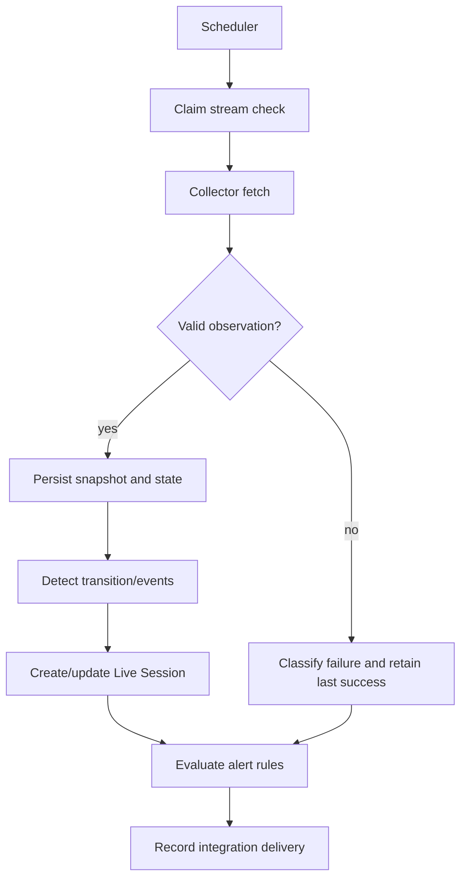
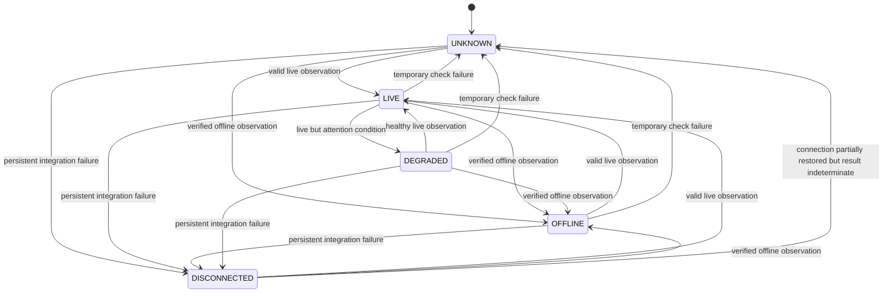

# Live Warden Monitoring Design

## Lifecycle

Monitoring Worker is a separate process in the Live Warden application. A scheduler periodically selects enabled, non-deleted streams. MVP defaults are 30-second interval, concurrency 1, 10-second collector timeout, 30-second lease, and at most one retry for retryable failures. Values are environment-configurable.

## Collection and Validation

Canonical result shape, status semantics, metric semantics, and error taxonomy are defined in [`Domain-Contract.md`](./Domain-Contract.md).

Collector retains a persistent `TikTokLiveConnection` instance per active monitored channel, continuously ingesting `ROOM_USER`, `CHAT`, and `LIKE` events. The worker claims streams on scheduler intervals (`WORKER_INTERVAL_MS=30000`) and flushes accumulated snapshot data, viewer counts (with room-info fallback), and deduplicated comment objects to the database.

Disconnected TikTok connections use bounded exponential reconnect delays from 1 to 30 seconds. Each connection has at most one reconnect timer; attempt count resets after 30 seconds of stable connection. Explicit verified offline stops and removes the connection instead of reconnecting. Disabled, deleted, and worker-shutdown connections are also pruned/closed.

Invalid, partial, or schema-incompatible responses never become a valid `OFFLINE` observation.

## Failure Handling

- Timeout: bounded retry with exponential backoff; unresolved temporary failure maps to `UNKNOWN`.
- Invalid response: no snapshot as valid state; map to `UNKNOWN`.
- Persistent connection/provider unavailability or invalid credential: `DISCONNECTED`.
- Rate limit: obey provider response and defer according to chosen strategy.
- Database failure: log correlation ID, avoid false state transition, retry job safely.
- Last successful state and `last_successful_at` remain visible after failure.
- Stale data is derived from age since last successful observation; stale data cannot be presented as current.

`UNKNOWN` means temporary inability to determine stream status. `DISCONNECTED` means integration/provider connection cannot be used, such as invalid credentials, unavailable integration, or persistent connection-level failure. Neither is `OFFLINE`.

## Canonical Status Transitions

`DEGRADED` requires a valid live observation plus a defined technical condition. Exact condition remains Open Decision. Invalid observations do not produce `DEGRADED`.

## Live Session Lifecycle

- On a transition to verified `LIVE`, create one open `live_sessions` row.
- Repeated `LIVE` checks update the existing session; unique open-session constraint prevents duplicates.
- `UNKNOWN`, `DEGRADED`, and `DISCONNECTED` never close a session.
- Only verified `OFFLINE` closes the session, calculates duration and aggregates, and emits `STREAM_ENDED`.
- Close operation is idempotent; retries do not recalculate contradictory terminal state.
- A session may remain open while monitoring is temporarily unknown; report displays incomplete/current monitoring context.

## Concurrency and Idempotency

Worker claims one stream check using a database-safe lease/lock. A stream must not have overlapping active checks. Concurrent process instances are safe through claim ownership, unique active session constraint, unique snapshot attempt, and idempotent event/alert keys. Worker restart releases expired claims; exact lease duration is an Open Decision.

No realtime message queue is used for MVP. Database scheduling and delivery records are durable; PostgreSQL `NOTIFY` is only a transient post-commit UI invalidation signal.

The MVP worker selects `TikTokCollector` for TikTok and retains `FakeCollector` for fake/test provider use. Claims use `FOR UPDATE SKIP LOCKED` plus `next_check_at`, `check_lease_until`, and `check_lease_token`; expired leases are reclaimable after worker restart.

Accepted checks are evaluated by Alert Engine in the same transaction. Three consecutive failed checks create WARNING monitoring failure; explicit DISCONNECTED creates CRITICAL connection failure. Successful LIVE or verified OFFLINE resolves matching conditions.

## Recovery

Successful observation after temporary failure emits `MONITORING_RECOVERED` or `CONNECTION_RECOVERED` according to failure class, updates last-success fields, and evaluates resolution rules. Recovery never fabricates missed snapshots or changes historical events.

## Open Decisions

- TikTok auth requirement and production-safe rate-limit strategy.
- LIKE multi-session validation and gift semantics.
- Viewer/activity thresholds and unexpected-stop grace period.
- Worker concurrency, scheduler lease, and non-reconnect timeout/retry values.
